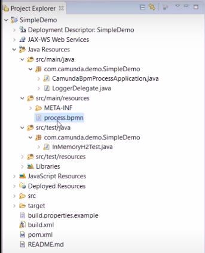

# Camunda Java simple integration
A simple camunda workflow - Java project integration with a mini tutorial describing setting and config

## Project

- The `SimpleDemo` file is the eclipse's Marven file created to define java Delegate 
classes
- The `SimpleDemo.war` is the compressed files generated to deploy on Camunda.

## Steps

- Open Eclipse and create a Marven Project
- Select Archetype `camunda-archetype-servlet-war`
- Group ID: `demo.camunda.name_of_group`
- Artifact ID(camelcase)
- Edit the BPMN file to create the workflow



- Create java custom task class in Eclipse that will be executed in each task. In 
creation, add JavaDelegate Superclass
- Add them in the BPM using the Camunda Modeler
- To generate war file, add at `pom.xml`:

```xml
<plugin>
    <groupId>org.apache.maven.plugins</groupId>
    <artifactId>maven-surefire-plugin</artifactId>
    <version>2.5</version>
    <configuration>
        <skipTests>false</skipTests>
        <testFailureIgnore>true</testFailureIgnore>
        <forkMode>once</forkMode>
    </configuration>
</plugin> 
```

- Then click with right button in the project, select `Run As->Maven install`
- At `target` folder, there will create a `.war` file. At this point copy this file 
 to `camunda-bpm-tomcat-7.14.0/server/apache-tomcat-9.0.36/webapps`

